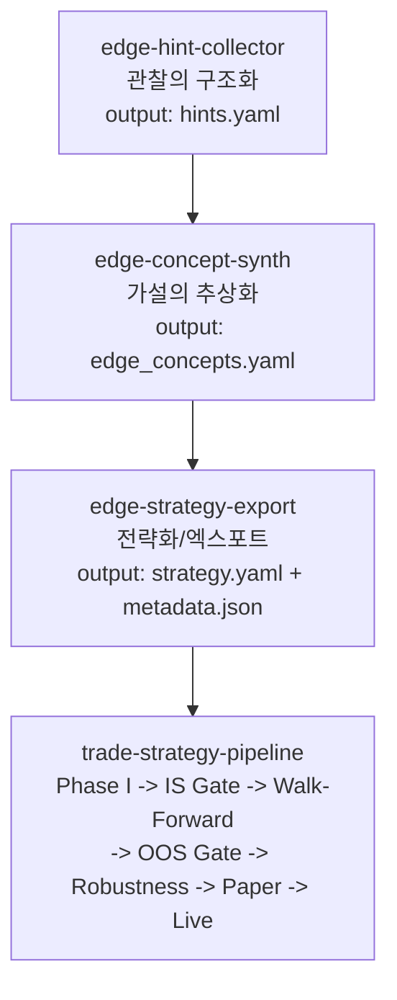
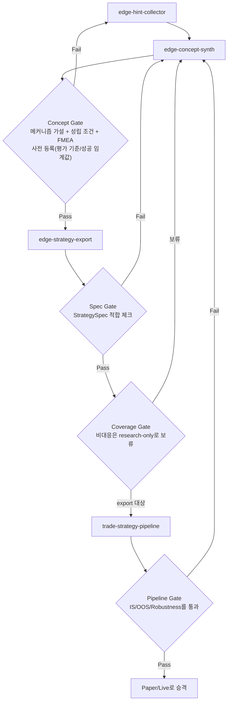
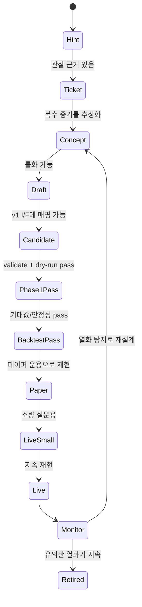
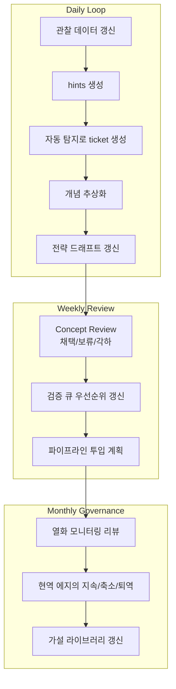

# 에지의 인스티튜셔널라이제이션 프로세스

일상의 "떠오른 아이디어"를, 속인적 메모로 끝내지 않고, 재현 가능한 전략 자산으로 승격시키기 위한 표준 플로우.

## 목적

- 관찰 -> 추상화 -> 전략화 -> 파이프라인 검증을 분업화한다
- 각 단계에서 "승급 게이트"를 정의하여 품질을 맞춘다
- 에지의 생성과 열화 모니터링을 동일한 운용 체계에 탑재한다

## 1. 3스킬 구성 + 파이프라인 접속

### 1-1. 메인라인

### 1-2. 반려 루프 (게이트 운용)

### 1-3. 구현 매핑 (현 리포지토리)

| 논리 스킬명 | 현재 구현 |
|---|---|
| edge-hint-collector | `skills/edge-hint-extractor` |
| edge-concept-synth | `skills/edge-concept-synthesizer` |
| edge-strategy-export | `skills/edge-strategy-designer` + `skills/edge-candidate-agent` (`export_candidate.py` / `validate_candidate.py`) |

## 2. 에지의 승급 스테이트 (진학 모델)

## 3. 일간/주간 운용 리듬

## 4. 승급 게이트의 최소 요건

| 게이트 | 최소 요건 | 실격 조건 |
|---|---|---|
| Concept Gate | thesis + invalidation_signals가 명시되어 있음 | 가설이 관찰의 환언에 불과 |
| Draft Gate | entry/exit/risk/cost가 정의 완료 | 비용 미고려, 구현 불가 조건 |
| Pipeline Gate | `edge-finder-candidate/v1` 계약을 충족 | schema 위반, dry-run 실패 |
| Promotion Gate | OOS에서 재현하며, 열화 모니터링 가능 | 특정 기간만 유효, 용량 부족 |

## 5. 우선 확인 포인트

1. `edge_concepts.yaml`의 `abstraction.thesis`와 `invalidation_signals`
2. `strategy_drafts/*.yaml`의 `risk`와 `validation_plan`
3. `validate_candidate.py` 결과 (I/F 적합)
4. 파이프라인 결과의 재현성 (기간 분할/레짐 분할)
