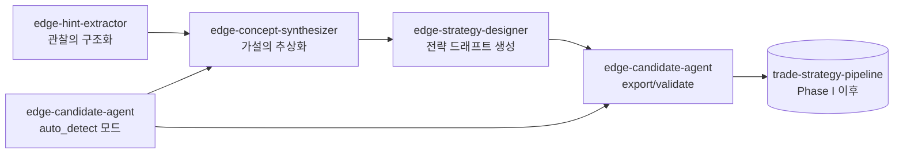
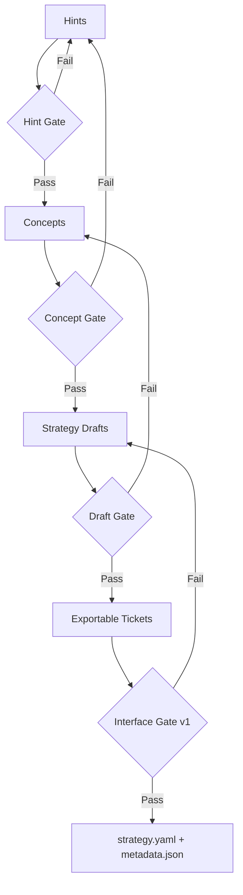

# 미국주식 에지 창출 에이전트 설계 (구현 반영판)

## 0. 목적
일간 관찰 데이터로부터,
**"재현 가능한 에지 가설"을 지속 생성하고, 전략 소재(strategy draft)까지 안정 공급하는**
운용 체계를, 현행 4스킬 구현에 맞추어 재설계한다.

- 대상 시장: 미국주식 (롱 중심)
- 주 호라이즌: 수일~수주 (연구 테마에 따라서는 60영업일)
- 본 설계의 목표:
  1) 관찰을 `hints.yaml`로 구조화
  2) 티켓군을 `edge_concepts.yaml`로 추상화
  3) 개념을 `strategy_drafts/*.yaml`로 전략화
  4) export 가능한 안을 `ticket -> strategy.yaml + metadata.json`으로 승격 가능하게 한다

> 구 `docs/edge_candidate_agent_design.md`는 구상 단계의 단일 에이전트 전제.
> 본 문서는 구현 완료된 분할 아키텍처(4스킬)에 대응한 운용 설계이다.

---

## 1. 스코프
### 1.1 In Scope
- 일간 EOD 관찰로부터의 에지 가설 생성
- 가설의 추상화 (메커니즘 가설 + 실효 시그널)
- 전략 드래프트화 (복수 배리언트)
- `edge-finder-candidate/v1` 호환 후보로의 변환 준비

### 1.2 Out of Scope
- 실전 집행 (발주/약정 관리)
- 완전 자동 채용 판단 (최종 채택은 사람 리뷰를 남긴다)
- v1 미대응 시그널의 자동 strategy export (research-only로 유지)

---

## 2. 설계 원칙
1. 관찰과 전략 구현을 직결시키지 않는다 (추상화 레이어 필수)
2. "설명 가능성"을 유지한다 (`thesis` / `invalidation_signals`를 필수화)
3. export 가능성을 명시 분리한다 (`export_ready_v1`과 `research_only`)
4. 시장 환경 의존을 전제화한다 (`regime`을 전 단계에서 유지)
5. 일간으로 돌리고, 주간으로 선별하고, 월간으로 열화 모니터링한다

---

## 3. 시스템 전체상 (4스킬 분할)



- 주계열(권장): `Hint -> Concept -> Draft -> Export/Validate`
- 지름길(보조): `auto_detect_candidates.py`로 티켓을 자동 생성하여 개념화로 흘린다

---

## 4. 각 스킬의 책무와 I/O

| 스킬 | 주 책무 | 주 입력 | 주 출력 |
|---|---|---|---|
| `edge-hint-extractor` | 관찰 데이터를 힌트화 | `market_summary.json`, `anomalies.json`, `news_reactions.*`(임의) | `hints.yaml` |
| `edge-concept-synthesizer` | 티켓군을 개념 클러스터로 추상화 | `tickets/**/*.yaml`, `hints.yaml`(임의) | `edge_concepts.yaml` |
| `edge-strategy-designer` | 개념을 전략 드래프트로 변환 | `edge_concepts.yaml` | `strategy_drafts/*.yaml`, `run_manifest.json`, `exportable_tickets/*.yaml`(임의) |
| `edge-candidate-agent` | 탐지/티켓화/export/계약 검증 | `ohlcv.parquet`, `hints.yaml`(임의), `ticket.yaml` | `daily_report.md`, `tickets/*`, `strategies/<id>/strategy.yaml`, `metadata.json` |

---

## 5. 데이터 계약 (현행 구현 기반)

### 5.1 Hint 계약 (`hints.yaml`)
필수 최소는 `hints: []`. 각 hint는 아래를 권장.

- `title`
- `observation`
- `preferred_entry_family` (임의, `pivot_breakout` / `gap_up_continuation`)
- `symbols` (임의)
- `regime_bias` (임의)
- `mechanism_tag` (임의)

### 5.2 Concept 계약 (`edge_concepts.yaml`)
클러스터 키는 구현상 `hypothesis_type x mechanism_tag x regime`.

필수 운용 항목:
- `abstraction.thesis`
- `abstraction.invalidation_signals`
- `strategy_design.recommended_entry_family`
- `strategy_design.export_ready_v1`

### 5.3 Strategy Draft 계약 (`strategy_drafts/*.yaml`)
- `variant`: `core` / `conservative` / `research_probe`
- `entry_family`: exportable이면 `pivot_breakout` or `gap_up_continuation`, 비대응은 `research_only`
- `risk_profile`: `conservative|balanced|aggressive`를 유지 (추적 가능성용)
- `validation_plan`을 전체 draft에 부여

### 5.4 Export Ticket 계약 (candidate-agent 투입용)
- 필수: `id`, `hypothesis_type`, `entry_family`
- `entry_family`는 v1에서 **2종류만**
  - `pivot_breakout`
  - `gap_up_continuation`

### 5.5 Pipeline IF v1 계약 (strategy.yaml)
`candidate_contract.py`에 준거. 특히 아래가 게이트.

- required top keys: `id,name,universe,signals,risk,cost_model,validation,promotion_gates`
- Phase I 제약:
  - `validation.method == full_sample`
  - `validation.oos_ratio`는 미설정 or `null`
- 엔트리별 필수 블록:
  - `pivot_breakout -> vcp_detection`
  - `gap_up_continuation -> gap_up_detection`

---

## 6. 처리 플로우 상세

### 6.1 Stage A: Hint Extraction (관찰의 구조화)
구현: `skills/edge-hint-extractor/scripts/build_hints.py`

입력 소스:
- 시장 서머리 (임의)
- 이상 탐지 (임의)
- 뉴스 반응 (임의)
- LLM 보조 (임의, `--llm-ideas-cmd`)

로직 요점:
- regime 추정 (`RiskOn/RiskOff/Neutral`)
- anomaly/news를 룰 기반으로 hint화
- LLM hint를 수신하여 스키마 정규화
- 중복 제거 후 `max_total_hints`로 제한

기대 성과:
- downstream이 재사용 가능한 관찰 컨텍스트를 매일 생성

### 6.2 Stage B: Concept Synthesis (가설의 추상화)
구현: `skills/edge-concept-synthesizer/scripts/synthesize_edge_concepts.py`

로직 요점:
- ticket을 클러스터화 (`hypothesis_type/mechanism/regime`)
- support 통계 작성 (`ticket_count`, `avg_priority_score`, symbol 분포)
- `thesis` / `invalidation_signals`를 명시
- entry family 분포로부터 `recommended_entry_family`를 결정
- v1 export 가부를 `export_ready_v1`로 명시

기대 성과:
- 과적합을 피한 "개념 단위 리뷰"의 토대를 구축

### 6.3 Stage C: Strategy Design (전략 소재화)
구현: `skills/edge-strategy-designer/scripts/design_strategy_drafts.py`

로직 요점:
- exportable 개념은 `core + conservative`를 생성
- non-exportable 개념은 `research_probe`를 생성
- risk profile로 `risk_per_trade`, `max_positions`를 조정
- 임의로 `exportable_tickets/*.yaml`을 출력

기대 성과:
- 개념으로부터 검증 가능한 전략 소재를 복수 안으로 공급

### 6.4 Stage D: Candidate Agent (탐지/수출/검증)
구현:
- 탐지: `auto_detect_candidates.py`
- export: `export_candidate.py`
- validate: `validate_candidate.py`

모드 1: Auto-detect (관찰 기점)
- OHLCV에서 특징량 생성/regime 판정/anomaly 탐지
- exportable 후보(breakout/gap)와 research-only 후보(panic_reversal 등)를 분리 출력

모드 2: Export/Validate (설계 기점)
- `exportable_tickets`를 `strategy.yaml + metadata.json`으로 변환
- `edge-finder-candidate/v1` 계약 검증
- 임의로 `--pipeline-root` 연계하여 `uv run`으로 schema/stage 검증

---

## 7. 후보 유형의 취급 방침 (v1 전제)

### 7.1 Export 대상 (즉시 전략화 가능)
- `breakout` -> `pivot_breakout`
- `earnings_drift` -> `gap_up_continuation`

### 7.2 Research-only (개념 자산으로 축적)
- `panic_reversal`
- `regime_shift`
- `sector_x_stock`
- `calendar_anomaly`
- `news_reaction`
- `futures_trigger`

> 연구 후보는 버리지 않는다.
> `edge_concepts.yaml`과 `strategy_drafts(research_probe)`로 유지하며, I/F 확장 시 재승격한다.

---

## 8. 승급 게이트 (운용 품질)



### 8.1 Gate 정의
- Hint Gate
  - 입력 결손이나 중복으로 힌트 품질이 열화되지 않았음
- Concept Gate
  - `thesis`와 `invalidation_signals`가 명시
  - support가 최저 임계값 이상 (`--min-ticket-support`)
- Draft Gate
  - `entry/exit/risk/validation_plan`이 채워져 있음
- Interface Gate
  - `validate_ticket_payload`와 `validate_interface_contract`를 통과

---

## 9. 일간 오케스트레이션 사양

### 9.1 표준 플로우 (권장)
1. `edge-candidate-agent` auto detect로 `market_summary/anomalies/tickets`를 갱신
2. `edge-hint-extractor`로 `hints.yaml`을 갱신 (룰 + 필요 시 LLM)
3. `edge-concept-synthesizer`로 `edge_concepts.yaml` 생성
4. `edge-strategy-designer`로 `strategy_drafts`와 `exportable_tickets` 생성
5. `edge-candidate-agent` export/validate로 전단 게이트를 통과시킨다

주기 (운용 방침):
- 일간 운용은 **1패스** (hints는 개념화 입력으로 사용)
- 같은 날 내에 `auto_detect_candidates.py`를 `--hints`로 재실행하지 않는다

### 9.2 대표 커맨드
```bash
# 1-pass 운용: detector는 먼저 1회만 실행 (hints 반영을 위한 재실행은 하지 않는다)

# 1) detector
python3 skills/edge-candidate-agent/scripts/auto_detect_candidates.py \
  --ohlcv data/us_ohlcv.parquet \
  --output-dir reports/edge_candidate_auto \
  --top-n 12 --top-research-n 10

# 2) hints
python3 skills/edge-hint-extractor/scripts/build_hints.py \
  --market-summary reports/edge_candidate_auto/market_summary.json \
  --anomalies reports/edge_candidate_auto/anomalies.json \
  --output reports/edge_hints/hints.yaml

# 3) concepts
python3 skills/edge-concept-synthesizer/scripts/synthesize_edge_concepts.py \
  --tickets-dir reports/edge_candidate_auto/tickets \
  --hints reports/edge_hints/hints.yaml \
  --output reports/edge_concepts/edge_concepts.yaml \
  --min-ticket-support 2

# 4) drafts
python3 skills/edge-strategy-designer/scripts/design_strategy_drafts.py \
  --concepts reports/edge_concepts/edge_concepts.yaml \
  --output-dir reports/edge_strategy_drafts \
  --exportable-tickets-dir reports/edge_strategy_drafts/exportable_tickets \
  --risk-profile balanced

# 5) export/validate
python3 skills/edge-candidate-agent/scripts/export_candidate.py \
  --ticket reports/edge_strategy_drafts/exportable_tickets/<ticket>.yaml \
  --strategies-dir /path/to/trade-strategy-pipeline/strategies

python3 skills/edge-candidate-agent/scripts/validate_candidate.py \
  --strategy /path/to/trade-strategy-pipeline/strategies/<id>/strategy.yaml
```

---

## 10. 스코어링과 우선도 운용

### 10.1 구현상의 우선도
- detector는 `priority_score`(0-100)로 후보를 랭킹
- hint 일치로 스코어를 가점 (symbol 일치로 강가점)
- ATR 과대는 페널티

### 10.2 운용상의 우선순위축
- `priority_score` (효과의 강도)
- `support.ticket_count` (재현 빈도)
- `export_ready_v1` (즉시 검증 가능성)
- `regime`과의 정합 (현 국면 적합)

---

## 11. 주간/월간 운용

### 11.1 Weekly Review
- `edge_concepts.yaml` 채택/보류/각하
- `strategy_drafts`의 상위안을 검증 큐로
- research-only 테마의 재우선순위 부여

### 11.2 Monthly Governance
- export 후보의 통과율 (Draft -> Interface)
- 개념별 실효 시그널 발화 빈도
- regime별 후보 품질 변화

---

## 12. 에러 처리와 폴백
- optional 입력 부족은 처리를 계속하고, `skipped_modules`에 기록
  - `news_reaction(no_input)`
  - `futures_trigger(no_input)`
- pipeline 연계가 없어도 interface 검증까지는 실행 가능
- LLM 연계 실패 시에는 rule-based hints만으로 계속

---

## 13. 디렉토리 표준안

```text
reports/
  edge_candidate_auto/
    market_summary.json
    anomalies.json
    watchlist.csv
    daily_report.md
    tickets/
      exportable/*.yaml
      research_only/*.yaml
  edge_hints/
    hints.yaml
  edge_concepts/
    edge_concepts.yaml
  edge_strategy_drafts/
    run_manifest.json
    *.yaml
    exportable_tickets/*.yaml
```

---

## 14. KPI (운용 건전성)
1. 일간: `concept_count`, `draft_count`, `exportable_ticket_count`
2. 주간: Concept 채택률, Draft 반려율
3. 월간: Interface Gate 통과율, research-only의 재승격 건수
4. 보조: 동일 concept의 지속 기간, 실효 시그널 발화 횟수

---

## 15. MVP (최소 운용)
1. detector + hints + concept + drafts의 4단을 일간으로 실행
2. `min-ticket-support=2`로 노이즈 개념을 억제
3. risk profile은 `balanced` 고정으로 시작
4. export는 `pivot_breakout` / `gap_up_continuation`만
5. 주 1회 채택 회의, 월 1회 실효 모니터링

---

## 16. 향후 확장 (구현 로드맵)
- v2 I/F로 `panic_reversal`, `regime_shift`, `sector_x_stock`를 단계적 export 대응
- Concept 단에서 regime 분해 통계(RiskOn/Neutral/RiskOff별 지지율)를 표준 출력
- Draft 단에서 용량/유동성 제약을 정량화한 validation_plan 자동 강화
- hint 생성에 뉴스 요약/이벤트 분류기를 도입하여 관찰 품질을 향상

---

## 부록 A: 역할 분담의 요점
- `edge-hint-extractor`: 관찰의 노이즈를 줄여 힌트로 정형화
- `edge-concept-synthesizer`: 티켓을 개념 자산으로 승격
- `edge-strategy-designer`: 개념을 비교 가능한 전략 소재로 전개
- `edge-candidate-agent`: 자동 탐지와 v1 계약으로의 출구 관리

이 4분할에 의해,
"떠오른 아이디어"를 직접 strategy화하는 것이 아니라,
**관찰 자산 -> 개념 자산 -> 전략 자산**의 순서로 제도화할 수 있다.
